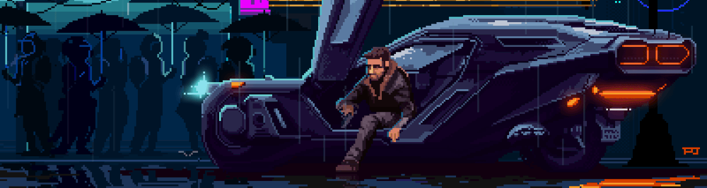
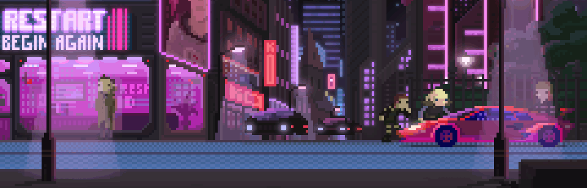

<h2 align="center">Hi 👋! My name is Arnaud F. and I'm a passionate Full Stack developer, from France</h2>

###

 

 

<h3 align="center"><strong>Languages, Frameworks, and Tools</strong></h3>

###

 

<h2 align="center">🏆 My Github Stats</h2>

###

###

 

<h2 align="center">✉️ Contact</h2>

###

 

  
  
  
  

###

 

###

 

<strong style="display:block; text-align:right; font-size:10px; font-weight:normal;">Credits: [Blade Runner 2049](https://www.behance.net/gallery/81092071/Blade-Runner2049-(Re-edit)) by [Pixel Jeff](https://www.behance.net/pixeljeff)</strong>
