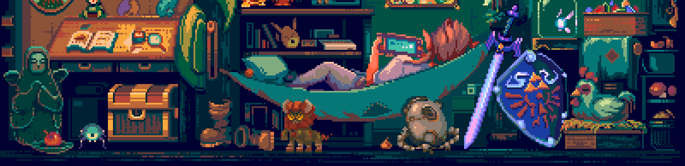

<h1 align="center">Hi 👋, I'm Arnaud F.</h1>
<h3 align="center">A passionate fullstack developer from France</h3>

<h3 align="center"><strong>Languages, Frameworks, and Tools</strong></h3>

<h2 align="center">🏆 My Github Stats</h2>

<h2 align="center">✉️ Contact</h2>

<small>Credits: [Blade Runner 2049](https://www.behance.net/gallery/81092071/Blade-Runner2049-(Re-edit)) & [Child of the Wild](https://www.behance.net/gallery/170466977/Chill-of-the-Wild) by [Pixel Jeff](https://www.behance.net/pixeljeff)</small>