  

---

<pre>
------------------------------------------------------------
SYSTEM BOOT
------------------------------------------------------------
CPU     : Z80 @ 4 MHz
RAM     : 64K
MODE    : DEV
TARGET  : GITHUB
STATUS  : READY
------------------------------------------------------------
</pre>

---

## ▶ PLAYER PROFILE

<pre>
NAME   : ARNAUD
CLASS  : WEB DEVELOPER
ALIGN  : FULL-STACK
ZONE   : FR

SPECIALITIES :
- Web applications
- Tooling & automation
- Retro & creative coding
</pre>

---

  

---

## ▶ QUEST LOG

<pre>
MAIN QUEST :
> Building useful and maintainable web tools
  with a strong focus on clean code.

SIDE QUESTS :
> Retro-inspired interfaces & experiments
> Music & sound generation
> Narrative and game tools

DAILY QUEST :
> Write clean code
> Improve existing systems
> Learn something new
</pre>

---

## ▶ DISK CATALOG

<pre>
============================================================
                 DISK CATALOG - ISSUE #01
------------------------------------------------------------
EDITORIAL :
A selection of personal projects and experiments
distributed as individual programs.

------------------------------------------------------------
[DISK 01]
TITLE  : Fantasy Character Creator
TYPE   : Tool / Generator
STYLE  : Retro / UI
NOTES  : Character creation & experimentation

------------------------------------------------------------
[DISK 02]
TITLE  : Retro Music
TYPE   : Sound / Chiptune
STYLE  : 8-bit / Procedural
NOTES  : Music experiments inspired by old systems

------------------------------------------------------------
[DISK 03]
TITLE  : Experiments
TYPE   : Misc / Prototype
STYLE  : Games / Narrative
NOTES  : Small projects, tests and ideas

------------------------------------------------------------
END OF CATALOG
============================================================
</pre>

---

## ▶ PORTS

<pre>
LINKEDIN : https://www.linkedin.com/in/arnaudfl
DEV.TO   : https://dev.to/arnaudfl
MEDIUM   : https://medium.com/@arnaudfl
TWITTER  : https://twitter.com/arnaudfl
</pre>

---

  

